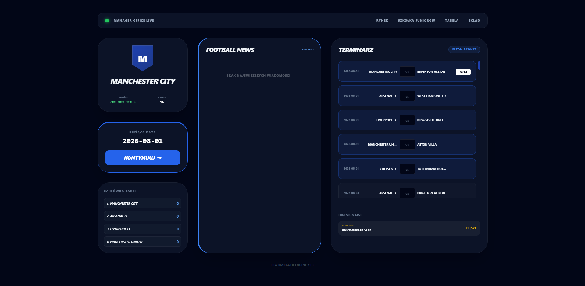
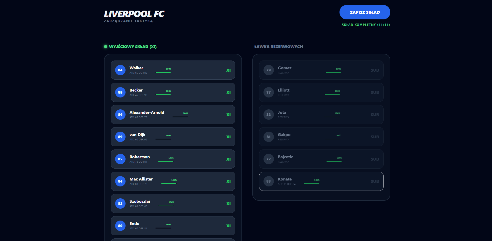
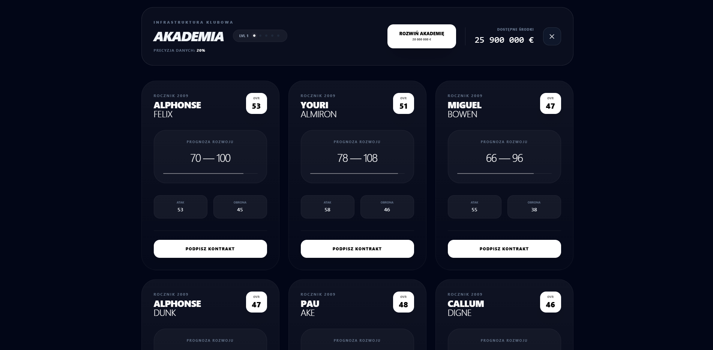
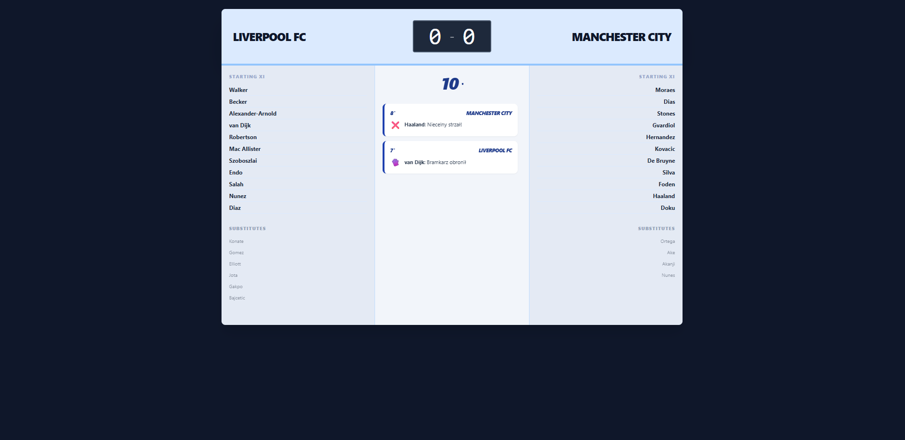

# Football Manager - Spring Boot Demo

A lightweight and modern **Football Manager** simulation game built with **Spring Boot 4**. Manage any team in the league, scout for wonderkids in your academy.

## 🚀 Features

- **Multi-Club Management:** Start your career by choosing ANY team in the league. The entire dashboard and economy adapt to your selection.
- **Youth Academy & Scouting:** - Generate and recruit young talents.
  - Upgrade your academy infrastructure (Level 1-5) to increase scouting precision.
  - Dynamic potential estimation based on your club's scouting level.
- **Advanced Match Engine:** A probability-based simulation calculating outcomes using player-specific offensive/defensive stats and current stamina.
- **Interactive Match Live View:** - Real-time minute-by-minute simulation.
  - Dynamic events: goals, saves, misses, and yellow cards.
  - Visual analytics: possession bars and momentum indicators.
- **Economy & Transfers:** - Realistic market value scaling.
  - AI-driven transfer offers for your players.
  - Squad management (starters vs. reserves).
- **Dynamic News Feed:** Stay updated with injury reports, transfer breakthroughs, and training progress.

## 🛠 Tech Stack

- **Backend:** Java 25, Spring Boot 4 (Web, Data JPA, Thymeleaf)
- **Frontend:** HTML5, Thymeleaf, Tailwind CSS (via CDN)
- **Database:** H2 (In-Memory)
- **Utilities:** Lombok

## 📋 Prerequisites

- **JDK 21** or **25**
- **Maven** 3.8+

## ⚙️ Quick Start

1. **Clone the repository:**
   ```bash
   git clone [https://github.com/suwinho/springboot-footballmanager.git](https://github.com/suwinho/springboot-footballmanager.git)
   cd springboot-footballmanager
   ```
2. **Build and run:**
   ```bash
   mvn spring-boot:run
   ```
3. **How to play:**
   - New Career: Go to http://localhost:8080 (you will be redirected to the Team Selection screen).
   - Dashboard: Manage your squad, check league table, and advance days.
   - Youth Academy: Visit /youth-academy to scout for new prospects and upgrade facilities.
   - Transfers: Browse the market to strengthen your squad.
   - H2 Console: http://localhost:8080/h2-console (JDBC URL: jdbc:h2:mem:footballmgr)

4. **Screens:**
   
   
   
   
